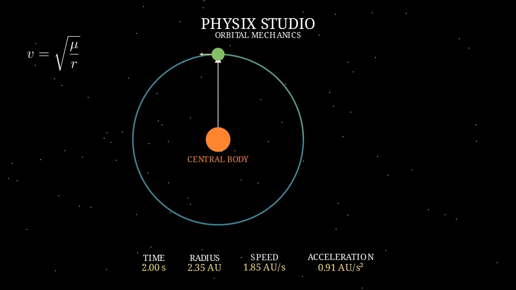
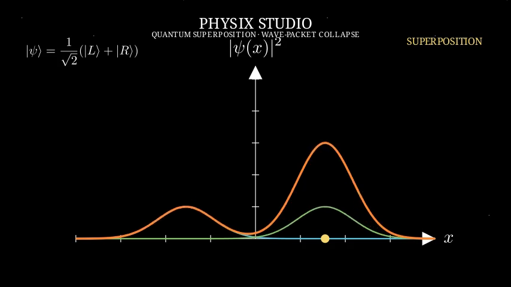

# PhysiX Studio

**Physics Simulation → Scientific Visualization → Animated Graphs → Cinematic Educational Content**

> **SEO summary:** PhysiX Studio is an open-source Python framework for deterministic physics simulation, Manim scientific animation, orbital mechanics, quantum visualization, gravitational lensing, live graphs, and educational STEM video production.

PhysiX Studio is an open-source Python project for building reproducible physics simulations and scientific animations. One authoritative simulation state drives every visual component through a deterministic timeline. Its defining abstraction is an **object graph cursor**: a physical visual object, such as a Moon or orbiting planet, can move along a graph at the point `(simulation_time, measured_value)` without drifting from the curve.

**Discoverability keywords:** Python physics simulation, scientific visualization, Manim animation, educational physics, orbital mechanics, Kepler's laws, quantum wave packet, gravitational lensing, numerical simulation, deterministic simulation, STEM education, animated graphs, computational physics, open-source science software.

## Current MVP

This implementation provides a typed immutable `PhysicsState`, a deterministic `TimelineController`, analytical and numerical constant-acceleration motion, event detection, replayable state history, coordinate-safe `LiveGraph`, generic `ObjectGraphCursor`, centralized themes, a CLI, a tested Moon Ascent data pipeline, and a deterministic circular-orbit model. The physics layer has no visualization dependency. Manim adapters remain optional.

## Quickstart

```bash
python -m venv .venv
. .venv/bin/activate
pip install -e ".[dev]"
pytest
physix simulate moon-ascent --duration 10 --samples 11
python examples/moon_ascent.py
```

## Cinematic Rendering

The unique rendering feature is that **physical objects can become live graph cursors**. The physical Moon and a smaller graph Moon are both driven by the same `PhysicsState(t)`: one is mapped into physical scene coordinates and the other into `LiveGraph.coords_to_point(time, height)`. The Height vs Time curve is progressively revealed from the same recorded history.

Manim is an optional renderer adapter, never the physics clock:

```bash
pip install -e ".[manim]"
physix render moon-ascent --quality draft --output ./media
physix render orbital-mechanics --quality draft --output ./media
physix preview orbital-mechanics --quality draft
physix preview quantum-collapse --quality draft
physix preview gravitational-lensing --quality draft
```

The supported scenes are `moon-ascent`, `orbital-mechanics`, `quantum-collapse`, and `gravitational-lensing`; quality profiles are `draft`, `standard`, `high`, and `production`. Use `physix preview ...` to render and open the animation in the local video player for a real-time user-facing preview. Use `physix render ...` to save an MP4. Users who only need the simulation core do not install Manim. See [`docs/rendering/`](docs/rendering/) for the rendering architecture and scene guides.

### Orbital mechanics preview

The orbital scene synchronizes a planet, elliptical orbit trail, equal-area sweep, radius vector, velocity vector, Kepler equation panel, and live telemetry from one analytical orbital state.



See [`docs/rendering/orbital-mechanics.md`](docs/rendering/orbital-mechanics.md) for the model and rendering details.

### Video demo

[Download or play the verified 1920×1080 60 fps orbital mechanics demo](docs/assets/orbital-mechanics-1080p60.mp4).

### Quantum wave-packet collapse

The quantum scene shows two Gaussian wave packets in superposition and animates measurement into the right-hand collapsed state.



See [`docs/rendering/quantum-collapse.md`](docs/rendering/quantum-collapse.md) for the scene details and preview command.

### Gravitational lensing

The relativistic scene visualizes a point-mass lens, Einstein radius, two apparent images, bent light paths, and magnification in the thin-lens approximation.

See [`docs/rendering/gravitational-lensing.md`](docs/rendering/gravitational-lensing.md) for the scene details and preview command.


### Custom scene tutorial

Read the [custom physics scenes tutorial](docs/tutorials/custom-physics-scenes.md) to learn how to define a deterministic model, build a Manim projection, register `render` and `preview` commands, write tests, inspect screenshots, and document a new scene.

## Architecture

```text
TimelineController → SimulationEngine → PhysicsState(t)
                                      ├→ Physical object adapter
                                      ├→ LiveGraph + ObjectGraphCursor
                                      └→ Dashboard / equation adapters
```

There are no independent object, graph, or dashboard timers. A renderer samples the same state at the same time. See [`docs/architecture.md`](docs/architecture.md) and [`docs/adr/`](docs/adr/).

## Roadmap

Future physics modules include eccentric orbits, N-body mechanics, projectile motion, waves, and electromagnetism.

## Contributing

See [`CONTRIBUTING.md`](CONTRIBUTING.md). Please keep physics independent from presentation, add tests for new models, and document architectural changes as ADRs.

## Topics and hashtags

`#Python` `#PhysicsSimulation` `#ScientificVisualization` `#Manim` `#ComputationalPhysics` `#OrbitalMechanics` `#QuantumPhysics` `#GravitationalLensing` `#STEMEducation` `#OpenSource` `#EducationalTechnology` `#NumericalSimulation`
