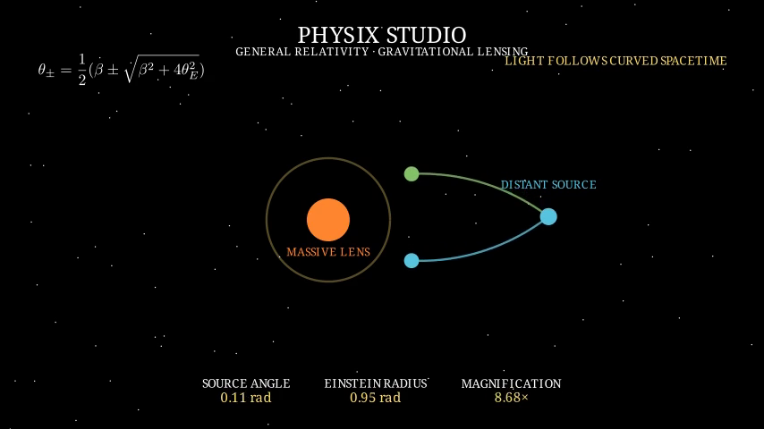

# Gravitational Lensing Scene

`GravitationalLensingScene` visualizes the thin-lens approximation for a point mass. A massive foreground lens deflects light from a distant source, producing two apparent image positions. The scene animates the source offset, bent ray paths, Einstein-radius ring, and magnification telemetry.

The lens model uses:

```text
θ± = 1/2 (β ± √(β² + 4θE²))
```

The scene is educational and normalized. It does not claim to be a full general-relativistic ray tracer. The approximation is useful because it exposes the image-splitting relationship and makes the effect of a curved spacetime geometry visible without requiring a numerical spacetime solver.

Preview locally:

```bash
physix preview gravitational-lensing --quality draft
```

Export an MP4:

```bash
physix render gravitational-lensing --quality draft --output ./media
```

The verified draft render is a 12-second 480p15 MP4. A representative frame is included below.


